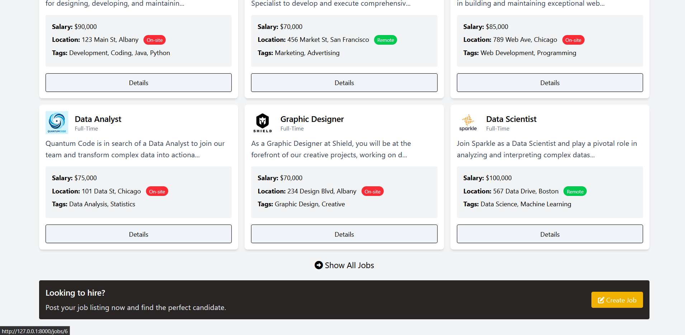
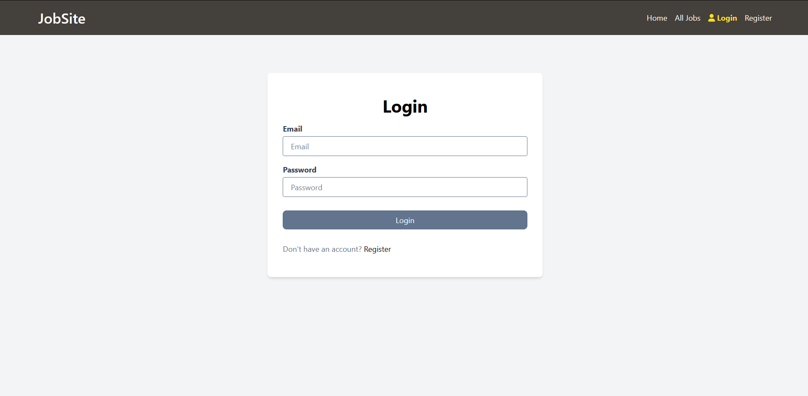
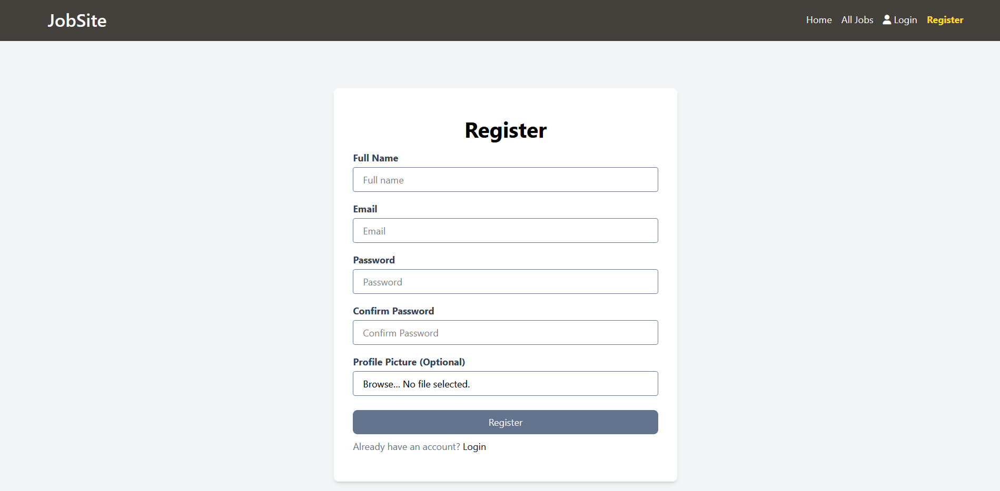
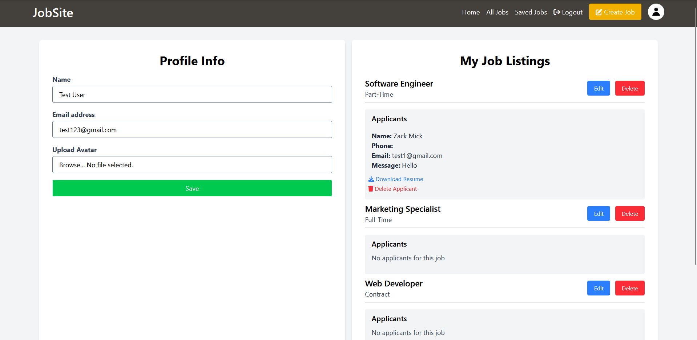
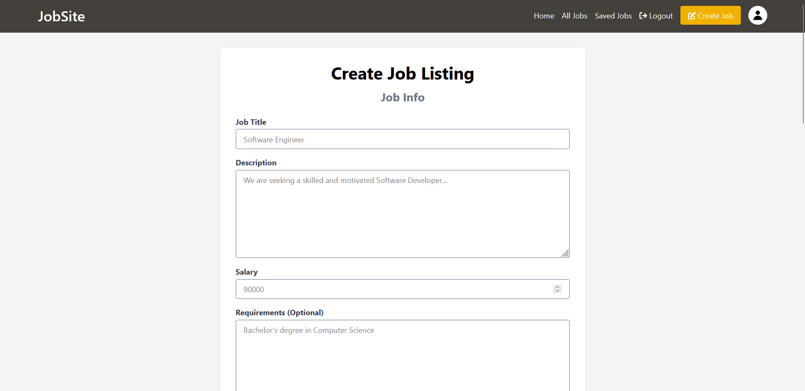
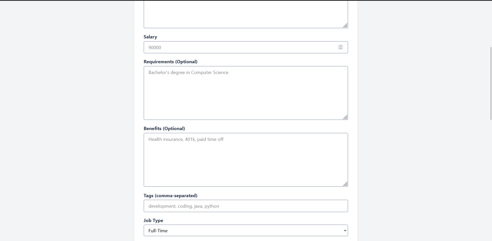
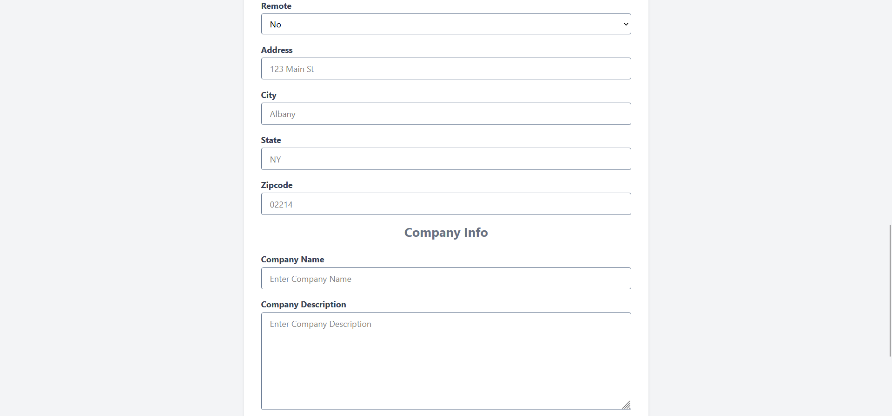
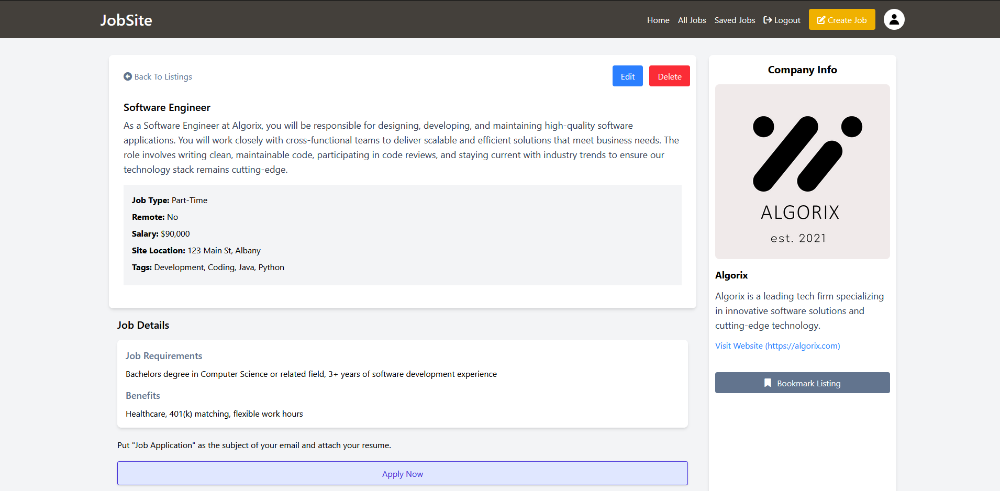
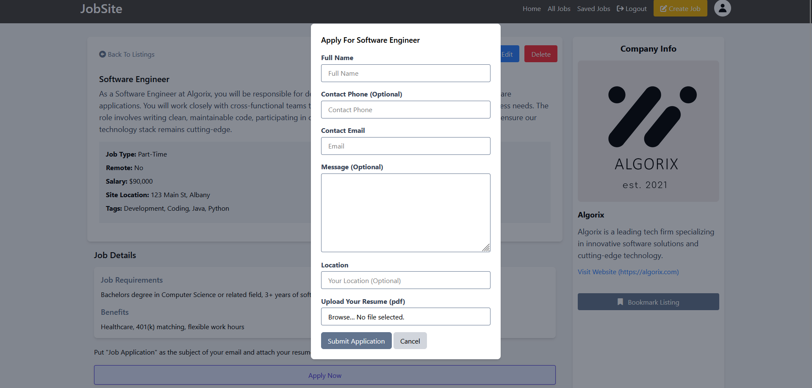

# JobSite (Laravel)

JobSite is a job listing website built with Laravel 12, Tailwind CSS, AplineJs and PostgreSQL as the database.

<!--  -->

## The Home page

## Features

-   Job Listing CRUD
-   Authentication & Authorization Policies
-   Profile Avatar Upload
-   Blade UI Components
-   Tailwind Integration
-   Bookmarking System
-   Apply & Upload Resume
-   User Dashboard
-   Alpine.js For Interactivity
-   Database Seeder
-   Job Search
-   Job Listing Pagination

## Login Page

## Register Page

## Dashboard

## Create Job

## Viewing a job

## Applying for a job

